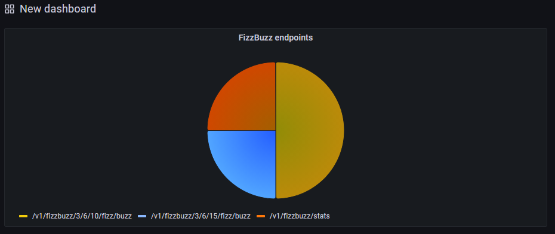
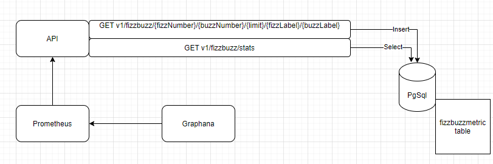

# FizzBuzz

## Feature explanation

```
"Exercise: Write a simple fizz-buzz REST server.

The original fizz-buzz consists in writing all numbers from 1 to 100, and just replacing all multiples of 3 by "fizz", all multiples of 5 by "buzz", and all multiples of 15 by "fizzbuzz". The output would look like this: "1,2,fizz,4,buzz,fizz,7,8,fizz,buzz,11,fizz,13,14,fizzbuzz,16,...".


Your goal is to implement a web server that will expose a REST API endpoint that:

Accepts five parameters : three integers int1, int2 and limit, and two strings str1 and str2.

Returns a list of strings with numbers from 1 to limit, where: all multiples of int1 are replaced by str1, all multiples of int2 are replaced by str2, all multiples of int1 and int2 are replaced by str1str2.


The server needs to be:

Ready for production

Easy to maintain by other developers

- Add a statistics endpoint allowing users to know what the most frequent request has been.

This endpoint should:

- Accept no parameter

- Return the parameters corresponding to the most used request, as well as the number of hits for this request

```

## Launch

This project requires `docker`

To Lauch the project with all dependancies you can do the command from docker :

`docker-compose build` to build the .net image of the api
`docker-compose up` to deploy a container with the image

you have a folder `dbscripts -> seed.sql` which is automatically executed when the postgreSql is installed.

## Endpoints

### HealthCheck endpoint

You can call the endpoints bellow to be sure the service and all the services are correctly available :

`GET http://localhost:8080/_system/check/full`

Just to know if the API is UP :

`GET http://localhost:8080/_system/check/simple`

### FizzBuzz endpoint

You can use the FizzBuzz endpoint in the URL bellow :

`GET http://localhost:8080/v1/fizzbuzz/{fizzNumber}/{buzzNumber}/{limit}/{fizzLabel}/{buzzLabel}`

Example :

`http://localhost:8080/v1/fizzbuzz/3/6/10/fizz/buzz`

### FizzBuzz metrics

You have a dedicated endpoint to know what the most frequent request has been done.

`GET http://localhost:8080/v1/fizzbuzz/stats`

## Prometheus and Grafana

You can display all the metrics scrapped by prometheus :

`GET http://localhost:9090/metrics`

You can access to grafana through this URL and create a dedicated panel :

`http://localhost:3000/?orgId=1`

1. Add your first data source
2. Select prometheus and specify the good URL for prometheus `http://prometheus:9090/`
3. Create new dashboard
4. Fill metrics browser with this : `fizzbuzz_path_counter{endpoint=~"/v1/fizzbuzz.*"}`



## Project Overwiew

Just bellow you can find the infra architecture of this project :



The application archicture is defined as bellow :

```
.
├── FizzBuzz
│   └── Api
│   └── Application
│       └── Services
│   └── Domain
│       └── Entities
│       └── Interface
|   └── Infrastructure
│       └── Repositories
│   └── Tests
```

Architecture inspired by Onion Architecture

Onion Architecture is based on the inversion of control principle. Onion Architecture is comprised of multiple concentric layers interfacing each other towards the core that represents the domain. The architecture does not depend on the data layer as in classic multi-tier architectures, but on the actual domain models.

### Next steps

- [ ] Create a swagger for preprod configuration
- [ ] Add more security for token to call those endpoints
- [ ] Add more security about password on the file configurations
